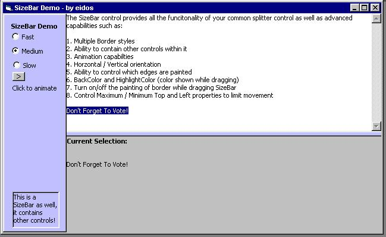



## AdvancedUI Sizebar Control

### Description

This is the first entry in my AdvancedUI line of ActiveX controls for Visual Basic. It provides all the capabilities of the common splitter / sizer control with a LOT of new ones. Animation, Control Container, Color customization, Border customization. Tons! check it out!!!
 
### More Info
 
Astonishment

             |
---                |---
**Submitted On**   |2001-12-24 12:52:04
**By**             |[eidos](https://github.com/Planet-Source-Code/PSCIndex/blob/master/ByAuthor/eidos.md)
**Level**          |Intermediate
**User Rating**    |4.8 (19 globes from 4 users)
**Compatibility**  |VB 5\.0, VB 6\.0
**Category**       |[OLE/ COM/ DCOM/ Active\-X](https://github.com/Planet-Source-Code/PSCIndex/blob/master/ByCategory/ole-com-dcom-active-x__1-29.md)
**World**          |[Visual Basic](https://github.com/Planet-Source-Code/PSCIndex/blob/master/ByWorld/visual-basic.md)
**Archive File**   |[AdvancedUI4390812242001\.zip](https://github.com/Planet-Source-Code/eidos-advancedui-sizebar-control__1-30092/archive/master.zip)

### API Declarations

See Project

